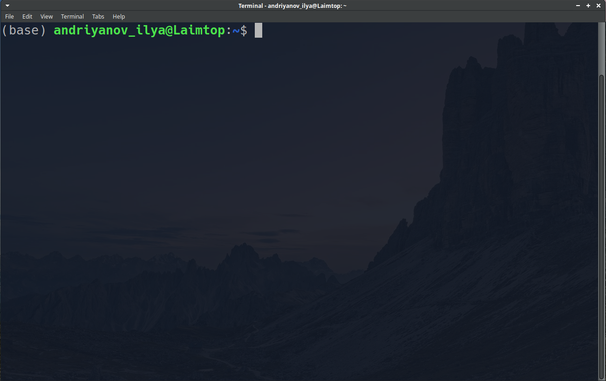

# Краткое пояснение интерактивной работы на ЛР
Этот файл примерно следует проведенной на лабораторной работе №1
деятельности и предназначен для более подробного освещения трудных и не
только моментов.

**Оглавление**

- [Краткое пояснение интерактивной работы на ЛР](#краткое-пояснение-интерактивной-работы-на-лр)
    - [О том, как получен данный документ](#о-том-как-получен-данный-документ)
    - [Краткий ликбез по терминалу](#краткий-ликбез-по-терминалу)
        - [Основное окно терминала](#основное-окно-терминала)
        - [Перечень использованных команд терминала](#перечень-использованных-команд-терминала)
        - [Немного о файловой системе семейства UNIX](#немного-о-файловой-системе-семейства-unix)
        - [Где лежат мои файлы, если я на Windows?](#где-лежат-мои-файлы-если-я-на-windows)
    - [Работа с репозиториями](#работа-с-репозиториями)
        - [Понятие о системах контроля версий](#понятие-о-системах-контроля-версий)
        - [Структура репозитория git](#структура-репозитория-git)
        - [Создание репозитория](#создание-репозитория)
        - [Работа с репозиторием](#работа-с-репозиторием)
        - [Работа с клонированным репозиторием](#работа-с-клонированным-репозиторием)
        - [Код демо (или похожий на него)](#код-демо-или-похожий-на-него)


## О том, как получен данный документ
Настоящий документ создан при помощи простого языка разметки
[Markdown](https://ru.wikipedia.org/wiki/Markdown), и если вы читаете
html версию данного текста, то с исходным текстом можете ознакомиться
в файле [DemoExplanation.md](./DemoExplanation.md).
Markdown повсеместно используется при оформлении
документации репозиториев, а потому крайне полезен для изучения, если вы
планируете работать с кодом (и не только).

## Краткий ликбез по терминалу

### Основное окно терминала
Если вы выполнили предварительные шаги и установили git, то у вас
в любом случае появилась новая программа - *эмулятор терминала*
(далее просто терминал), с
которой мы и будем иметь дело. Ниже представлен типичный вид окна
терминала.


Основной элемент окна - строка приглашения, и состоит она из
следующих элементов:

- Имени пользователя или логина \<andriyanov_ilya\>;
- Разделяющего символа \<@\>;
- Имени машины (сервера или ПК), которым управляет терминал
  \<Laimtop\>;
- Текущей рабочей директории \<~\>;
- Разделяющего символа \<$\>, за которым следует текст команды, которую
  вы набираете.

> Возможно вам не очень понятно, но текущая директория \<~\> является
>  сокращением, которое обозначает домашнюю директорию пользователя. В
> моем случае это /home/andriyanov_ilya. В вашем же случае она
> определяется значением
> [переменной среды](https://ru.wikipedia.org/wiki/Переменная_среды) HOME
> вашей ОС (или подОС, в случае WSL).

### Перечень использованных команд терминала
Строка приглашения терминала ожидает выполнения команд. Командой, вообще
говоря, может являться не только операции, что мы перечислим ниже, но
также и вызовы обычных программ. К примеру, если ввести в терминал
**vi**, то произойдет запуск одноименного текстового редактора (если он
у вас, конечно же, установлен). Терминал может запустить любую вашу
программу, только если она расположена в директории, определяемой
переменной среды PATH, или же в текущей рабочей директории.

Помимо запуска программ, терминал также поддерживает выполнение
стандартных операций (некоторые из них тоже являются программами, а
некоторые обрабатываются самим эмулятором терминала):

- **pwd** - напечатать текущую рабочую директорию (Print Working Directory)
- **ls** - напечатать перечень файлов и директорий в текущей директории
- **echo example_text** - напечатать **example_text**
- **cd <new_path>** - сменить текущую рабочую директорию на ту, что
  находится по пути new_path
- **mkdir my_dir** - создать в рабочей директории директорию **my_dir**
- **touch my_file** - создать в рабочей директории пустой файл **my_file**
- **rm my_file** - удалить файл my_file
- **rm -r my_dir** - удалить директорию my_dir
- **cat my_file** - напечатать содержимое файла **my_file**

### Немного о файловой системе семейства UNIX
Ввиду того что ваш терминал ведет свою собственную файловую систему по
модели семейства операционных систем UNIX, то вам понадобятся некоторые
сведения о записи путей директорий и файлов.

Как и в других системах, путь к файлу(директории) может быть указан
абсолютно, начиная с корневой директории **/**, или относительно
текущей.
Рассмотрим оба способа на примере.
```Plain
Абсолютный путь:

  /usr/bin/bash

Относительный путь:

  ./WorkRepo/NonLinearTAU/Lab1/Homework_Assignment.pdf {или же}
  ../WorkRepo/NonLinearTAU/Lab1/Homework_Assignment.pdf

```
Итак, выше представлены примеры адресации файлов в стиле UNIX. Абсолютный
путь нисколько не отличается от стиля записи Windows, за исключением того,
что в качестве разделителя используется прямая косая черта, а не
обратная.

Относительный же путь может быть записан, начиная с одной или двух точек.
**Одна точка** символизирует рабочую директорию, **две точки** -
родительскую директорию для текущей.

> Стоит отметить, что многие программы без проблем воспринимают такой
> стиль записи в случае относительной адресации файлов на любой ОС,
> в отличие от стиля Windows (с разделитилем в виде
> обратной косой черты).
> Поэтому в своей работе (например в MATLAB) крайне рекомендуется для
> переносимости ваших программ использовать пути в стиле UNIX

### Где лежат мои файлы, если я на Windows?
Если вы открыли терминал на Windows (не путать терминал с командной
строкой cmd), то у вас установлен либо Cygwin, либо WSL.

В случае Cygwin директории файловой системы Windows располагаются по
адресу:
/cygdrive/. (В ней находятся директории, названия которых представляют
собой буквенные литералы логического диска (C, D и т.д.), а далее вглубь
них всё так же, как и на Windows).

Если вы пользуетесь WSL, то вся файловая система Windows
располагается в директории /mnt/.

## Работа с репозиториями

### Понятие о системах контроля версий

При помощи финального проекта вы могли понять, что работа в команде над
программным продуктом может превратить последний в хаотически склеенный
кусок из файлов, а потому требуются специальные инструменты, которые
помогут этого избегать. Одним из них является *система контроля версий*.

**Система контроля версий** - это специальная программа, которая
способна отслеживать некоторый перечень файлов на предмет появления в
них изменений, строго контролировать эти изменения, хранить их историю
а также помогать с интеграцией наработок нескольких пользователей

Множество файлов, которые как единое целое отслеживаются системой
контроля версий, а также служебные файлы системы контроля версий, к ним
относящиеся, в совокупности называют **репозиторием**.

Поговорим немного о классификации систем контроля версий (СКВ). Нас будет
интересовать один критерий.
По нему их делят на централизованные и децентрализованные.
Централизованные СКВ хранят весь репозиторий в одном экземпляре на
главном сервере, пользователи же получают лишь конкретную версию файлов
репозитория и вносят свои изменения на сервер путем обращения к СКВ.
В случае использования децентрализованной системы каждый пользователь
имеет у себя полную копию всего репозитория (включая историю изменений)
и может переключиться на любую существующую версию.

Одной из наиболее популярных систем в наше время является
децентрализованная бесплатная система [git](https://git-scm.com)
с открытым исходным кодом.
Именно поэтому она и выбрана для ознакомления.

### Структура репозитория git
Упрощенно структуру репозитория git можно представить в виде
ориентированного графа, очень похожего на дерево. Узлы этого графа
символизируют зафиксированную версию и называются коммитом (commit).
Ребра же представляют собой **изменения последующего коммита по
сравнению с предыдущим**, и именно разности между коммитами git и хранит
в репозитории.

Отдельные линейные структуры (ветви этого псевдодерева) называются
ветками изменений. Репозиторий обязан иметь хотя бы одну такую ветку
(главную ветку master (или main)),
а обычно их бывает не меньше двух.


### Создание репозитория

Создать репозиторий можно двумя способами:

- Инициализировать пустой репозиторий
- Склонировать уже существующий

Для создания пустого репозитория используется команда
```bash
git init
```
Она создаст в текущей директории каталог .git, который символизирует
наличие репозитория. Это заставит git отслеживать все изменения,
происходящие в рабочей директории.

Клонирование репозитория осуществляется при помощи команды git clone.
Следующий код скачает в текущую директорию репозиторий по ЛР с сервера
хранения репозиториев GitHub.

```bash
git clone https://github.com/BelloMak/TAU_Labs_2023.git
```

> Так как клонирование является сетевым взаимодействием, то для
> него используется какой-то протокол. Верхняя команда использует для
> клонирования протокол http. Тем не менее, git также поддерживает и
> работу по протоколу ssh. В случае клонирования публичных репозиториев
> особой разницы нет.
> Но когда вы попытаетесь склонировать не публичный, а приватный
> репозиторий, или же попытаетесь сделать некоторые другие сетевые
> действия, то сервер, с которым вы взаимодействуете, запросит логин и
> пароль от вашего аккаунта на нем. В какой-то момент вам надоест каждый
> раз вводить логин и пароль, и вы перейдете к протоколу ssh, который
> для авторизации использует ключи шифрования.

По результатам выполнения команды вы получите полную копию нашего
репозитория, сможете пользоваться файлами в нем и даже самостоятельно
вносить в него свои локальные изменения.

### Работа с репозиторием

Одной из главных команд git по работе с репозиториями является команда
git status, позволяющая вывести текущую ситуацию:

- Здоровье репозитория;
- Текущую ветку изменений;
- Перечень измененных файлов;
- Перечень файлов, находящихся внутри директории репозитория, но
  не являющиеся отслеживаемыми.

С помощью команды git add \<файл\> можно добавить файл в отслеживаемые.
Соответствующая ему команда удаления - git rm \<файл\>. Также команда
add используется, чтобы добавить измененный файл в очередь на
новый коммит.

Команда git branch выведет список существующих веток в репозитории.
Если написать git branch my_branch, то будет создана новая ветка my_branch.

С помощью команды git checkout my_branch можно переключиться на ветку
my_branch.

Команда git log выведет список всех коммитов в текущей ветке изменений
(q, чтобы выйти, если терминал вас не отпустил).

Команда git commit используется для создания коммита. Следующий код
создаст коммит с комментарием *init*
```bash
git commit -m "init"
```

С примерами работы всех этих (или почти) команд, можете ознакомиться в
демо коде ниже.

### Работа с клонированным репозиторием
В какой-то момент ваш склонированный репозиторий устареет. Это случится,
когда кто-то внесет изменения на сервер. Чтобы "подтянуть" новую версию
репозитория, необходимо вызвать последовательность команд
```bash
git fetch
git merge
```
Первая скачает изменения, а вторая - объединит их с вашей локальной
версией репозитория. На самом деле, для этой последовательности
есть синоним - команда git pull. Отсюда и возникло слово "подтягивание".

### Код демо (или похожий на него)
```bash
cd ~
mkdir Projects
cd Projects
git clone https://github.com/BelloMak/TAU_Labs_2023.git
cd TAU_Labs_2023
git status
git log
rm -r LinearTAU
git status
git restore ./LinearTAU
cd ..
mkdir my_repo
cd my_repo
git init
git status
touch README.md
git status
git add README.md
git commit -m "Initial Commit"
git config --global user.email "john_doe@example.com"
git config --global user.name "John Doe"
git commit -m "Initial Commit"
git log
```

Далее по сценарию демо идет создание ssh-ключа. Инструкция по этой
процедуре и также указания по его добавлению в ваш аккаунт github
лежат отдельно где-то около этого файла. ssh-ключ необходим для сетевого
взаимодействия с любым сервером по протоколу ssh. Удобство последнего
познается на практике, более сказать нечего.

Напоследок скажем, что КРАЙНЕ рекомендуется ознакомиться с ссылками по
git в необязательной части ДЗ к этой ЛР.
